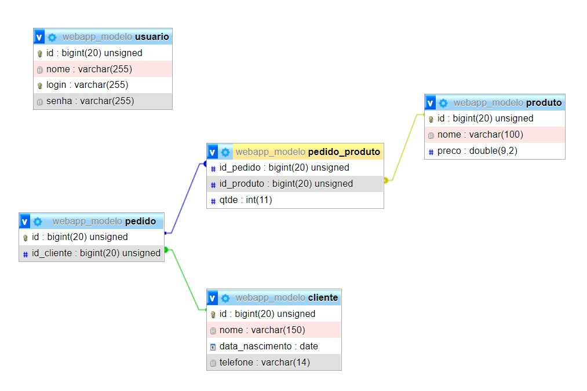

## Sobre o Projeto

Desenvolvido como modelo de implementação simples de aplicação web fullstack utilizando o framework Laravel em todos os recursos com implementação de Bootstrap no front-end, visando trabalhar as principais funcionalidades necessárias. Será trabalhado em aula ministrada por mim.

Os principais pontos abordados são:

- Migrations
- Models
- Relashionships
- Routes / Middleware
- Views com boostrap utilizando blade
- Requests e validações
- Controllers
  
- CRUD de Usuario
- Autenticação
- CRUD de Cliente
- CRUD de Produto
- CRUD de Pedido
- CRUD many-to-many de Pedido_Produto
  

